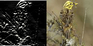

# Edge Detection with CUDA and NPP



## Overview

Edge detection is a fundamental technique in computer vision and image processing.
It identifies points in an image where the brightness changes sharply, which typically
corresponds to object boundaries, textures, and structural features.
One of the most widely used approaches is the **Sobel operator**, which applies
convolution kernels to approximate the image gradient in the horizontal and vertical directions.

This project implements GPU-accelerated edge detection using **CUDA** and
**NVIDIA Performance Primitives (NPP)**. It applies the Sobel filter to large image
datasets entirely on the GPU, leveraging NPP's optimized image processing routines
for high throughput.

---

## Datasets

The project supports two image datasets, which are downloaded and prepared via `download-data.py`
(see `INSTALL` for setup instructions).

### STL-10
The [STL-10 dataset](http://ai.stanford.edu/~acoates/stl10/) is a benchmark dataset from Stanford
originally designed for unsupervised feature learning. It contains 96×96 color images across
10 object categories (airplanes, birds, cars, cats, etc.). The training set (5,000 labeled images)
is extracted from a binary file and saved as JPGs under `data/stl10_images/`.

### USC SIPI Image Database
The [USC SIPI database](https://sipi.usc.edu/database/) is a classic collection of images
widely used in image processing research. This project uses two subsets:
- **Aerials**: high-resolution aerial photographs
- **Misc**: a standard set of grayscale and color test images (includes well-known images
  such as Lena, Baboon, and Peppers)

Images from both subsets are saved under `data/uscsipi_images/`.

---

## How It Works

The main program (`src/main.cu`) processes all images in the selected dataset directory
and saves the edge-detected results as PGM files under `data/outputs/`.

The pipeline for each image is:

1. **Load** the image from disk using the FreeImage library.
2. **Convert to grayscale** — Sobel edge detection operates on single-channel images.
3. **Transfer to GPU** — the grayscale pixel data is copied into an NPP device image (`npp::ImageNPP_8u_C1`).
4. **Apply the Sobel filter** on the GPU using NPP:
   - `nppiFilterSobelHoriz_8u_C1R_Ctx` for horizontal edges
   - `nppiFilterSobelVert_8u_C1R_Ctx` for vertical edges
5. **Copy result back** to host memory.
6. **Save** the output as a PGM file named `<dataset>_<edgetype>_img_<N>.pgm`.

### UtilNPP

The project uses the **UtilNPP** helper library from the
[NVIDIA CUDA Samples](https://github.com/NVIDIA/cuda-samples) repository.
This library provides the `npp::ImageCPU` and `npp::ImageNPP` template classes
(defined in `ImagesCPU.h`, `ImagesNPP.h`, `ImageIO.h`, and `Exceptions.h`)
which simplify host/device image allocation and data transfers.
UtilNPP is the helper library reviewed in the *CUDA at Scale for the Enterprise* course
and is installed inside the Docker image at `/usr/local/cuda/samples/Common/UtilNPP`.

---

## Docker Environment

The project runs inside a Docker container to ensure a reproducible environment with CUDA,
Python, and all required libraries pre-installed.

### `Dockerfile`

Builds the image on top of `nvidia/cuda:13.1.1-cudnn-devel-ubuntu22.04`. The build steps are:

1. Installs system dependencies (`wget`, `git`, `build-essential`) and `libfreeimage-dev`.
2. Installs **Miniconda** and creates the `npp_env` Conda environment from `environment.yml`.
3. Configures the shell to automatically activate `npp_env` and `cd` into the project directory on startup.
4. Clones the [NVIDIA CUDA Samples](https://github.com/NVIDIA/cuda-samples) repository and copies
   the files to `/usr/local/cuda/samples/`, making **UtilNPP** available for compilation.

### `docker-compose.yml`

Defines the `npp-dev` service with:
- The project root mounted as a volume at `/root/edge-detection-cuda` inside the container,
  so any changes made on the host are immediately reflected inside and vice versa.
- `gpus: all` — passes through all available NVIDIA GPUs to the container.
- `ipc: host` — shares the host IPC namespace, recommended for CUDA workloads.
- The container is named `cuda_project_workspace`.

### `environment.yml`

Defines the Conda environment `npp_env` used inside the container.

---

## Execution

All commands below should be run **inside the container**. See `INSTALL` for how to set it up.

### Build

```sh
make
```

This compiles `src/main.cu` with `nvcc` and produces the executable at `bin/edge_detector`.

### Run with default parameters

```sh
make run
```

Runs the program with the default settings:
- Dataset: `uscsipi`
- Edge type: `horizontal`

### Run with custom flags

```sh
./bin/edge_detector --dataset <dataset> --edges <edgetype>
```

| Flag | Values | Default | Description |
|------|--------|---------|-------------|
| `--dataset` | `stl10` \| `uscsipi` | `uscsipi` | Selects the input image dataset |
| `--edges` | `horizontal` \| `vertical` | `horizontal` | Selects the Sobel filter direction |

**Examples:**

```sh
# Vertical edges on STL-10
./bin/edge_detector --dataset stl10 --edges vertical

# Horizontal edges on USCSIPI (explicit)
./bin/edge_detector --dataset uscsipi --edges horizontal
```

Output images are saved to `data/outputs/` as PGM files.

### Clean build artifacts

```sh
make clean
```

---

## Visualizing Results

After running the edge detector, you can generate an animated GIF that compares
the edge-detected output with the original image side by side:

```sh
python3 make-gifs.py
```

This script:
- Reads the first 10 `.pgm` output files from `data/outputs/`
- Automatically detects which dataset was used from the filename prefix
- Pairs each output with its corresponding original image
- Creates a side-by-side frame (processed left, original right) for each pair
- Saves the result as `comparison.gif` in the project root (800 ms per frame, infinite loop)

The output GIF is shown at the top of this README.

---

## Code Organization

`src/` — CUDA source code (`main.cu`)

`bin/` — Compiled executable (generated by `make`)

`data/` — Image datasets and outputs (content ignored by Git)

`lib/` — Additional libraries if needed

`Dockerfile` / `docker-compose.yml` / `environment.yml` — Container environment definition

`download-data.py` — Script to download and prepare both datasets

`make-gifs.py` — Script to generate a comparison GIF from outputs

`Makefile` — Build system

`INSTALL` — Setup and installation instructions
